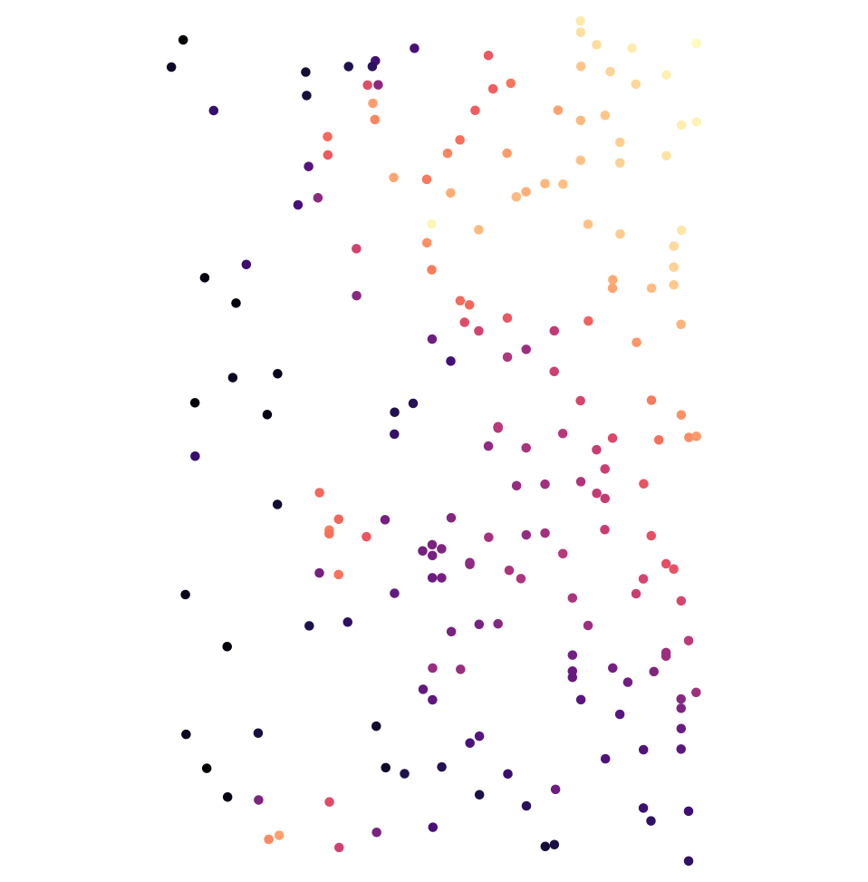
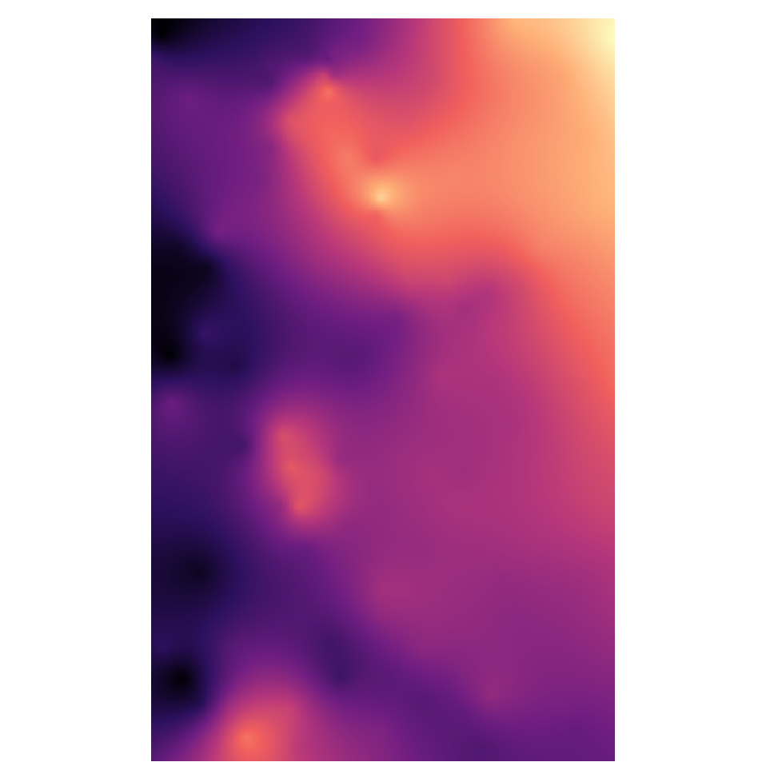

# Rust Interpolate

A learning project to implement geospatial interpolation using [ordinary kriging](https://gisgeography.com/kriging-interpolation-prediction/) in Rust.

Specifically my goals are:

- Parse a file of XYZ points representing observations
- Create a spatial index of the observations
- Create an empirical semivariogram from a sample of the input observations
- Create a mathematical model of the empirical semivariogram
- Estimate a raster grid covering the data extent
  - For every unknown point in the grid, use the model to predict the value and variance
- Write the predicted grid to a raster or vector file format.
  - For now, stick to simple human readable text formats.

## Kriging

Kriging is a geostatistical technique for predicting the value of a spatial phenonmenon at an unobserved location. Kriging is a form of interpolation that takes into account the spatial relationship between the data and provides, along with an estimated value, the variance or uncertainty in the value.

_Principles of Geographical Information Systems_ by Burrough and McDonnel (1998) was my primary source of inspiration and the gory mathematical details, particularly Chapters 5 and 6.

## Build

```
cargo build --release
```

## Test

Input: a text file with X, Y and Z values, tab-delimited. (see `test.xyz`)



Outputs:

1. Prediction grid in [ArcInfo ASCII Grid format](https://www.loc.gov/preservation/digital/formats/fdd/fdd000421.shtml)
2. Standard deviation grid in [ArcInfo ASCII Grid format](https://www.loc.gov/preservation/digital/formats/fdd/fdd000421.shtml)
3. Prediction points as geojson features (contains both predicted value and standard deviation as properties)



```
time ./target/release/rust-interpolate test2.xyz
```

The stderr logs

```
Parse XYZ file...
Create spatial index and removing dups...
extent [-125.0029566667, 41.481515, -124.66719, 42.0182683333]
Empirical semivariogram ...
Making predictions on grid... 256 x 410 with cellsize 0.0013115885417968598
./target/release/rust-interpolate --points test.xyz --range 0.2 >   20.67s user 0.00s system 99% cpu 20.673 total

➥ gdalinfo /tmp/estimates.grd -mm
Driver: AAIGrid/Arc/Info ASCII Grid
Files: /tmp/estimates.grd
Size is 256, 410
Origin = (-125.002956666700001,42.018268333300000)
Pixel Size = (0.001311588541797,-0.001311588541797)
Corner Coordinates:
Upper Left  (-125.0029567,  42.0182683)
Lower Left  (-125.0029567,  41.4805170)
Upper Right (-124.6671900,  42.0182683)
Lower Right (-124.6671900,  41.4805170)
Center      (-124.8350733,  41.7493927)
Band 1 Block=256x1 Type=Float32, ColorInterp=Undefined
    Computed Min/Max=-1124.295,-556.319
  NoData Value=-9999
```

## Maybe, someday?

This is a side project so I'm not likely to get around to this anytime soon. I welcome ideas and contributions though!

- [] Fit the model automatically, see [scipy](https://docs.scipy.org/doc/scipy/reference/generated/scipy.optimize.curve_fit.html#scipy-optimize-curve-fit)
- [] Support other models: Exponential, Linear, Gaussian, see [scikit-gstat](https://mmaelicke.github.io/scikit-gstat/reference/models.html)
- [] Cross-validation, MSPE on a subset of the original (removed prior to constructing empirical semivariogram)
- [] Parallel processing
- [] Python wrapper
- [] Refactor API and write unit tests
- [] Other distance metrics: geodesic distance, great circle distance, ECEF 3D distance
- [] Co-kriging
- [] Trend elimination (ie Universal Kriging)
- [] Subsetting and combining overlapping variogram models
- [] Anisotropy
- [] Bayesian estimation
